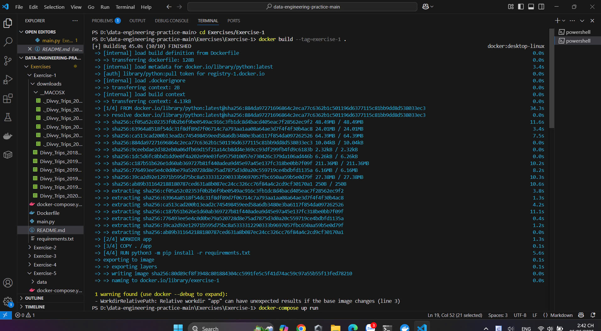
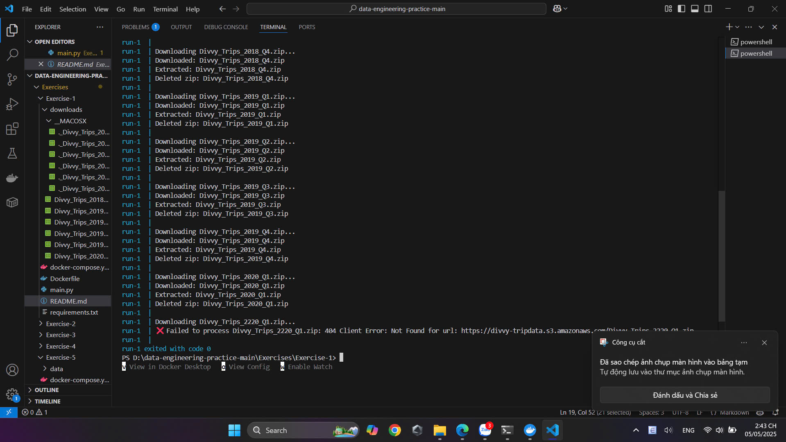
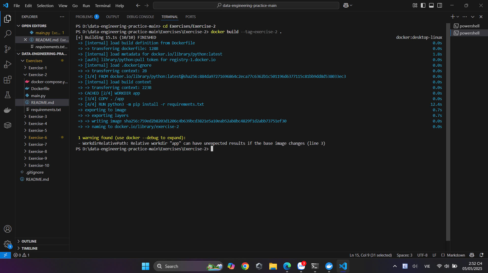
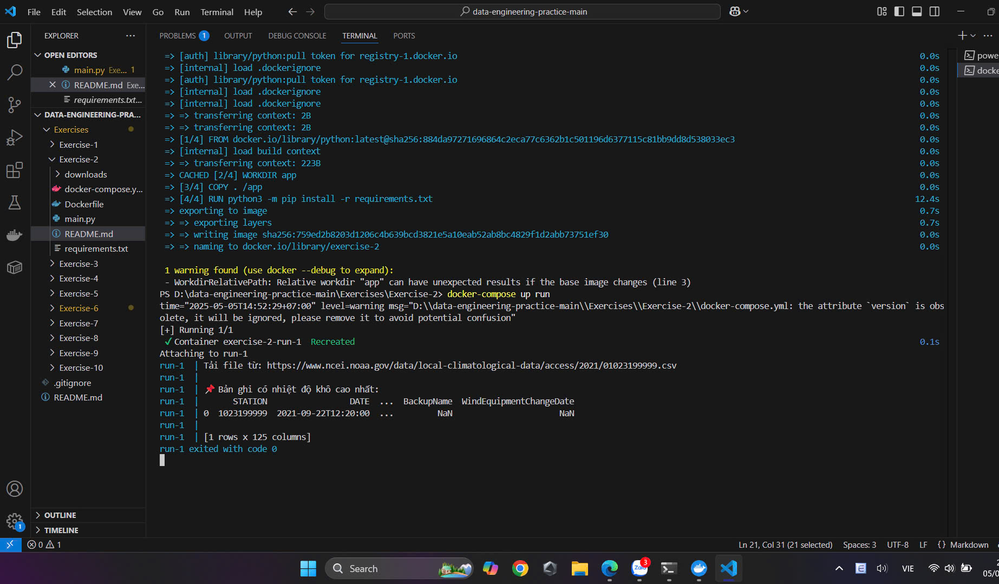
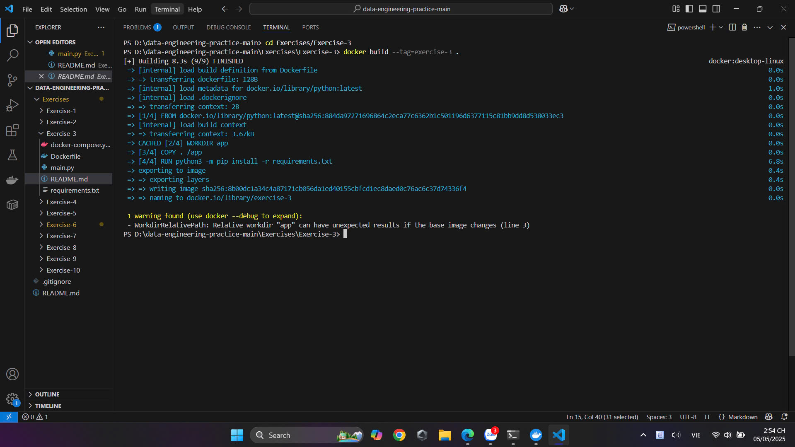
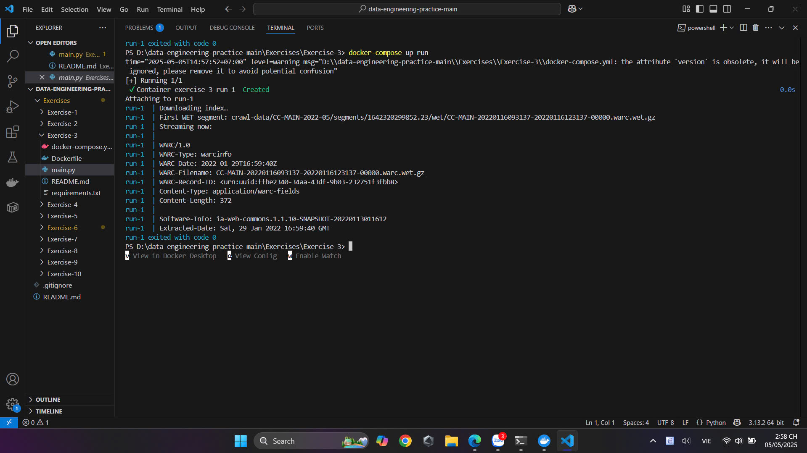
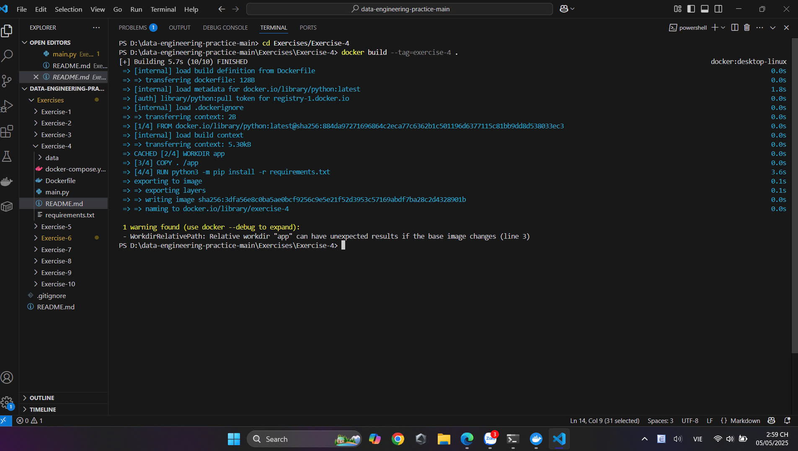
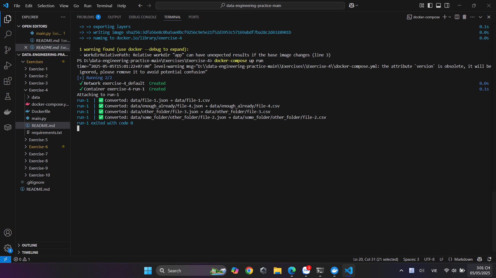
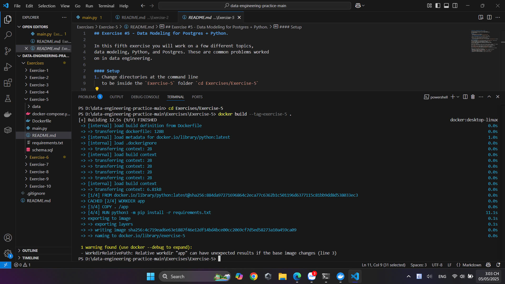
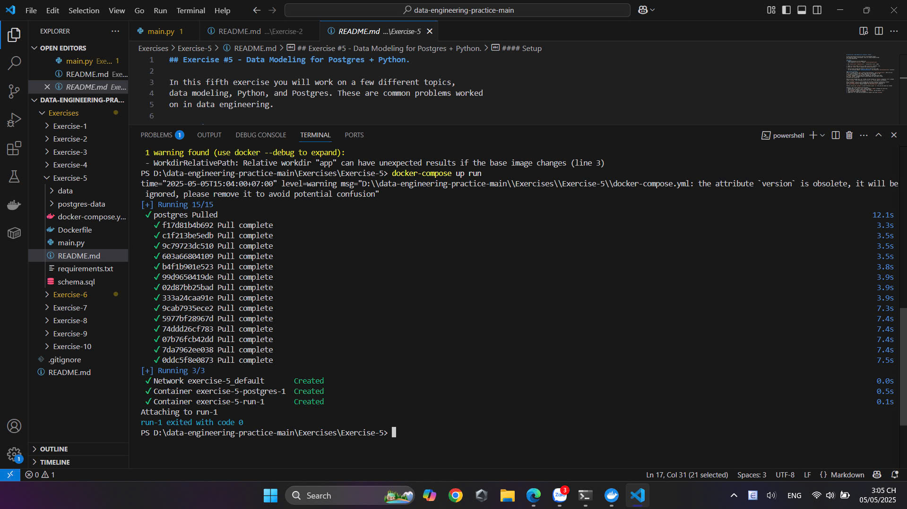

# Thành viên:

-Võ Đại Nhật Tân - 23714171

-Mai Văn Quân - 23703521

-Đỗ Nhất Thắng - 23708371

# BÁO CÁO LAB 9

## Exercise-1:

## Exercise-2:

## Exercise-3:

## Exercise-4:

## Exercise-5:

## Exercise-6:

### 1. Thời gian chuyến đi mỗi ngày trung bình là bao lâu ?

### 2. Mỗi ngày có bao nhiêu chuyến đi được thực hiện?

### 3. Trạm khởi hành phổ biến nhất cho mỗi tháng là gì?

### 4. 3 trạm dừng chân nào có lượng khách đi lại nhiều nhất mỗi ngày trong hai tuần qua?

### 5.Trung bình Male, s hay Females mất nhiều thời gian hơn cho chuyến đi?

### 6.10 độ tuổi có chuyến đi dài nhất và ngắn nhất là bao nhiêu?

## Exercise-7:

